# ShakespeareBot — Full-Stack Architecture (MVC + Pipeline)

> Format: Mermaid flowchart LR — renders natively on GitHub.
> Layout: View (left) → Controller (centre) → Model layers (right) → Data (far right)
> IPs/Ports: verified from vite.config.js and config.py
> Features: SSE streaming, agentic tool-use, RAG retrieval, NLP tragedy classifier,
>            multilingual STT/TTS, conversation memory, DVC ML pipeline

```mermaid
flowchart LR

    %% ══════════════════════════════════════════════════════
    %%  VIEW LAYER  (MVC — View)
    %% ══════════════════════════════════════════════════════
    subgraph VIEW["VIEW — React 18 + Vite · localhost:5173"]
        direction TB
        UI_TEXT["Text Input\nApp.jsx"]
        UI_MIC["Mic Button\nMediaRecorder API\nApp.jsx"]
        UI_MSG["Message Component\nMessage.jsx\nStreaming cursor ▌"]
        UI_AUDIO["Audio Playback\nbase64 → mp3\nnew Audio()"]
        UI_SSE["SSE Stream Reader\nsentence-by-sentence\napi.js"]

        UI_TEXT --> UI_SSE
        UI_MIC --> UI_SSE
        UI_SSE --> UI_MSG
        UI_MSG --> UI_AUDIO
    end

    %% ══════════════════════════════════════════════════════
    %%  CONTROLLER LAYER  (MVC — Controller)
    %% ══════════════════════════════════════════════════════
    subgraph CTRL["CONTROLLER — FastAPI + Uvicorn · localhost:8000"]
        direction TB
        CORS["CORS Middleware\nallow: localhost:5173"]
        LANG["Language Detection\nlangdetect"]
        RT_TEXT["POST /api/chat/text/stream\nSSE · StreamingResponse"]
        RT_AUDIO["POST /api/chat/audio/stream\nSSE · StreamingResponse"]
        RT_TEXT_NS["POST /api/chat/text\nnon-streaming fallback"]
        RT_AUDIO_NS["POST /api/chat/audio\nnon-streaming fallback"]
        HISTORY["Conversation History\n_MAX_HISTORY = 6 msgs\nthreading.Lock"]

        CORS --> LANG
        LANG --> RT_TEXT
        LANG --> RT_AUDIO
        LANG --> RT_TEXT_NS
        LANG --> RT_AUDIO_NS
        RT_TEXT --> HISTORY
        RT_AUDIO --> HISTORY
    end

    %% ══════════════════════════════════════════════════════
    %%  MODEL LAYER — NLP  (MVC — Model)
    %% ══════════════════════════════════════════════════════
    subgraph NLP["MODEL · NLP Classifier\nsrc/classifier.py"]
        direction TB
        TFIDF["TF-IDF Vectorizer\n5,000 features · ngram(1,2)\nmin_df=2"]
        NB["Naive Bayes Classifier\nMultinomialNB α=0.1\n95.35% accuracy"]
        CLF_OUT["Output\nlabel: tragedy / non-tragedy\nconfidence: 0.0–1.0"]

        TFIDF --> NB --> CLF_OUT
    end

    %% ══════════════════════════════════════════════════════
    %%  MODEL LAYER — STT  (MVC — Model)
    %% ══════════════════════════════════════════════════════
    subgraph STT["MODEL · Speech-to-Text\nstt/transcriber.py"]
        WHISPER["Whisper tiny\nopenai-whisper · local CPU\nmultilingual auto-detect"]
    end

    %% ══════════════════════════════════════════════════════
    %%  MODEL LAYER — AI AGENT  (MVC — Model)
    %% ══════════════════════════════════════════════════════
    subgraph AGENT["MODEL · AI Agent\nllm/agent.py"]
        direction TB
        CLAUDE["Claude claude-sonnet-4-6\nAnthropic API\nmax_tokens=320"]
        TOOL1["Tool: search_shakespeare_texts\n→ triggers RAG retrieval"]
        TOOL2["Tool: answer_directly\n→ skip RAG"]
        TOOL3["Tool: ask_for_clarification\n→ return question to user"]
        LOOP["Agentic Loop\nmax 3 iterations\nShakespeare persona"]

        CLAUDE --> LOOP
        LOOP --> TOOL1
        LOOP --> TOOL2
        LOOP --> TOOL3
    end

    %% ══════════════════════════════════════════════════════
    %%  MODEL LAYER — RAG  (MVC — Model)
    %% ══════════════════════════════════════════════════════
    subgraph RAG["MODEL · RAG Retrieval\nrag/retriever.py"]
        direction TB
        EMBED["Embedder\nparaphrase-multilingual-MiniLM-L12-v2\nsentence-transformers · local"]
        VSEARCH["Vector Similarity Search\nChromaDB · cosine similarity\nfetch top RAG_TOP_K=4"]
        RERANK["Word-Overlap Reranker\nkeep top 2 chunks\n[Source: filename] prefix"]

        EMBED --> VSEARCH --> RERANK
    end

    %% ══════════════════════════════════════════════════════
    %%  MODEL LAYER — TTS  (MVC — Model)
    %% ══════════════════════════════════════════════════════
    subgraph TTS["MODEL · Text-to-Speech\ntts/synthesizer.py"]
        direction TB
        EDGE["edge-tts · Microsoft Neural\nen-GB-RyanNeural (default)\n8 languages supported"]
        SENT["Sentence Splitter\n_split_sentences()\nmerge < 20 chars"]
        MP3["MP3 Audio Chunks\nbase64 encoded\nSSE streamed"]

        SENT --> EDGE --> MP3
    end

    %% ══════════════════════════════════════════════════════
    %%  DATA LAYER
    %% ══════════════════════════════════════════════════════
    subgraph DATA["DATA LAYER"]
        direction TB
        CHROMA["ChromaDB\nPersistentClient\nchroma_db/ · cosine space\ncollection: shakespeare_docs"]
        DOCS["Shakespeare .txt Docs\ndata/docs/ · 10 files\n4 tragedies · 3 comedies\n2 histories · 1 biography"]
        MODELS["Trained ML Models\nmodel/nb_tfidf.pkl\ndata/features/tfidf_vectorizer.pkl\nDVC-tracked artifacts"]
    end

    %% ══════════════════════════════════════════════════════
    %%  EDGES — Request flow
    %% ══════════════════════════════════════════════════════

    %% ── Frontend → Controller (Vite proxy /api → :8000) ──
    VIEW -->|"POST /api · JSON · HTTP/SSE\nVite proxy → :8000"| CTRL

    %% ── Audio path: Controller → STT ──
    RT_AUDIO -->|"audio blob · webm/wav"| STT
    STT -->|"text + language_code"| CTRL

    %% ── Controller → NLP Classifier ──
    CTRL -->|"question text"| NLP
    NLP -->|"label + confidence\nenriches search_query if conf > 0.6\npasses query_type to Agent"| CTRL

    %% ── Controller → Agent ──
    CTRL -->|"question · history · language\nquery_type · confidence"| AGENT

    %% ── Agent → RAG (when search tool selected) ──
    TOOL1 -->|"enriched search query"| RAG
    RAG -->|"top 2 source-prefixed chunks"| AGENT

    %% ── RAG → Data ──
    RAG -->|"cosine query · embedding vector"| CHROMA
    CHROMA -->|"document chunks + metadata"| RAG
    DOCS -.->|"ingested once\nrag/ingestor.py"| CHROMA
    MODELS -.->|"loaded at startup"| NLP

    %% ── Agent → Controller ──
    AGENT -->|"Shakespeare text response"| CTRL

    %% ── Controller → TTS → View ──
    CTRL -->|"text response"| TTS
    TTS -->|"SSE: audio_chunk events\nbase64 mp3 per sentence"| VIEW
```

---

## Behaviour Summary

### 1. Text Chat (Streaming)
User types a question → Vite proxies `POST /api/chat/text/stream` to FastAPI (:8000).
`langdetect` identifies the language. `classify_query()` (src/classifier.py) runs the NB model
and returns a label + confidence. If confidence > 0.6, the search query is enriched
("+ tragedy themes characters" or "+ history comedy sonnets"). The agentic loop in
`llm/agent.py` calls Claude with the question, conversation history (last 6 messages),
language, and query_type hint. Claude selects a tool: if `search_shakespeare_texts`,
the retriever fetches 4 ChromaDB candidates, reranks by word overlap, returns top 2.
Claude generates a response. `_split_sentences()` breaks it into sentence chunks.
Each chunk is synthesised by edge-tts and streamed as an SSE `audio_chunk` event.
A final `done` event carries `query_type` and `confidence`.
Source: `api/server.py::_stream_response()`

### 2. Voice Chat (Streaming)
User holds the mic → browser MediaRecorder captures audio → `POST /api/chat/audio/stream`.
Whisper tiny transcribes the audio locally and detects the language.
Pipeline continues identically to text chat from the classification step onward.
Source: `api/server.py::chat_audio_stream()`, `stt/transcriber.py`

### 3. NLP Classifier Integration
Every query — text or voice — passes through `classify_query()` before RAG.
The classifier loads `nb_tfidf.pkl` and `tfidf_vectorizer.pkl` once at module import.
If model files are missing (e.g. `dvc repro` not yet run), it returns
`{"label": "unknown", "confidence": 0.0}` and the app continues unaffected.
Source: `src/classifier.py`

### 4. Conversation Memory
All turns stored in `_conversation_history` (list of role/content dicts).
Capped at 6 messages (3 user + 3 assistant). Thread-safe via `threading.Lock`.
History injected into every Claude API call so Shakespeare remembers prior exchanges.
Source: `api/server.py::_append_history()`, `_get_history()`

### 5. DVC ML Pipeline (offline / training)
`dvc repro` runs 4 stages: prepare → featurize → train → evaluate.
Produces `model/nb_tfidf.pkl` (95.35% acc), `model/lr_svd.pkl`, `model/lr_pca.pkl`,
and `metrics/scores.json` + `metrics/confusion_matrices.png`.
The live app uses only `nb_tfidf.pkl` + `tfidf_vectorizer.pkl`.
Source: `dvc.yaml`, `src/pipeline/`

---

## Reference Tables

### Components
| Node | Component | Host:Port | Protocol | Source file |
|---|---|---|---|---|
| React UI | React 18 + Vite | localhost:5173 | HTTP / SSE | front_shakespeareBot/src/ |
| FastAPI | FastAPI + Uvicorn | localhost:8000 | HTTP / SSE | api/server.py |
| NLP Classifier | MultinomialNB + TF-IDF | in-process | — | src/classifier.py |
| Whisper STT | openai-whisper tiny | in-process (CPU) | — | stt/transcriber.py |
| Claude LLM | claude-sonnet-4-6 | Anthropic API (HTTPS) | HTTPS/REST | llm/agent.py |
| Embedder | paraphrase-multilingual-MiniLM-L12-v2 | in-process | — | rag/embedder.py |
| ChromaDB | PersistentClient | local disk | — | rag/vector_store.py |
| edge-tts | Microsoft Neural Voices | edge-tts API (HTTPS) | HTTPS | tts/synthesizer.py |

### Endpoints
| Method | Path | Mode | Handler |
|---|---|---|---|
| POST | /api/chat/text/stream | SSE streaming | chat_text_stream() |
| POST | /api/chat/audio/stream | SSE streaming | chat_audio_stream() |
| POST | /api/chat/text | Non-streaming fallback | chat_text() |
| POST | /api/chat/audio | Non-streaming fallback | chat_audio() |

### Data Stores
| Store | Collection | Path | Access |
|---|---|---|---|
| ChromaDB | shakespeare_docs | chroma_db/ | cosine similarity query |
| ML Models | — | model/*.pkl | pickle load at startup |
| Source Docs | — | data/docs/ (10 .txt) | read once by ingestor |

### Inviolable Constraints
| Constraint | Mechanism | Source file |
|---|---|---|
| Shakespeare persona never changes | System prompt hardcoded, not parameterised | llm/agent.py |
| Max agentic iterations = 3 | `_MAX_LOOP = 3` | llm/agent.py |
| History capped at 6 messages | `_MAX_HISTORY = 6` + trim | api/server.py |
| Classifier fallback if models missing | try/except FileNotFoundError at import | src/classifier.py |
| CORS restricted to localhost:5173/5174 | CORSMiddleware allow_origins | api/server.py |

---

## Assumptions

None — all details verified from source.
